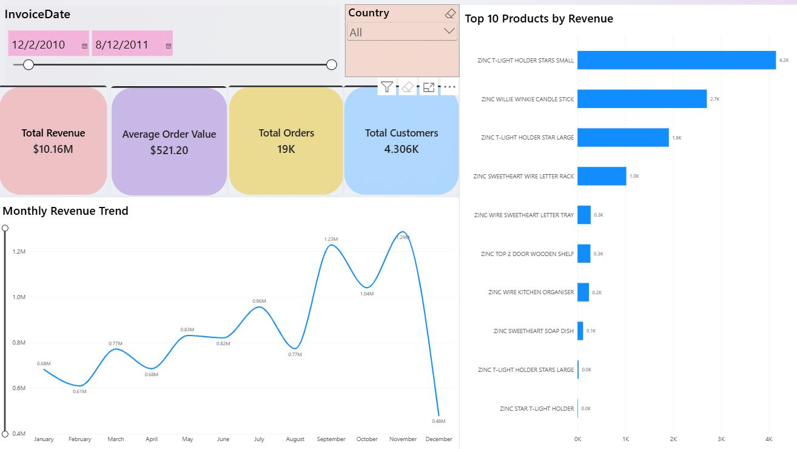

# E-commerce Sales Performance & Customer Analytics Dashboard

A Power BI portfolio project focused on analyzing e-commerce sales performance, profitability, order trends, and customer purchasing behavior.

**Project Type:** Personal Portfolio Project
**Primary Tool:** Microsoft Power BI
**Focus:** Data Analysis, Data Modeling, DAX, KPI Reporting, and Data Visualization

## Project Overview

This project uses Microsoft Power BI to explore e-commerce sales data and transform it into an interactive business intelligence dashboard.

The dashboard is designed to help business stakeholders monitor key performance indicators, evaluate product and category performance, understand sales trends, and explore customer purchasing patterns.

## Business Questions

* How are revenue, profit, and order volume performing?
* How do sales and profit change over time?
* Which product categories contribute most to sales and profitability?
* How does average order value compare across different segments?
* What patterns can be identified in customer purchasing behavior?
* How do business results change when different report filters are applied?

## Dashboard Features

* **Executive KPI Overview:** Monitor Total Revenue, Total Orders, Total Profit, and Average Order Value (AOV).
* **Sales and Profit Trend Analysis:** Explore changes in revenue and profitability over time.
* **Product and Category Performance:** Compare product categories and identify potential sales and profitability opportunities.
* **Customer Analytics:** Explore customer purchasing patterns and customer-level performance where supported by the dataset.
* **Payment Analysis:** Examine payment method distribution where payment information is available.
* **Interactive Filtering:** Use available slicers to explore results across relevant dates, regions, categories, and other business dimensions.

## Tools and Skills

* **Power BI:** Interactive dashboards and business reporting
* **DAX:** Measures and KPI calculations
* **Power Query:** Data cleaning and transformation
* **Data Modeling:** Organizing data for analytical reporting
* **Data Analysis:** Sales trends, profitability, and customer behavior
* **Data Visualization:** Presenting business metrics through charts and KPI cards
* **Business Intelligence:** Translating data into business insights

## DAX Measures

The following measures illustrate the core business metrics used in this project. Column and table names should match the actual Power BI data model.

### Total Revenue

```dax
Total Revenue =
SUM('Sales'[Sales Amount])
```

### Total Profit

```dax
Total Profit =
SUM('Sales'[Profit])
```

### Profit Margin %

```dax
Profit Margin % =
DIVIDE([Total Profit], [Total Revenue], 0)
```

Format this measure as a percentage in Power BI.

### Total Orders

```dax
Total Orders =
DISTINCTCOUNT('Sales'[Order ID])
```

This measure counts unique order IDs.

### Average Order Value (AOV)

```dax
Average Order Value =
DIVIDE([Total Revenue], [Total Orders], 0)
```

This measure calculates average revenue per distinct order.

## Key Findings and Analysis

The dashboard supports analysis of:

* Overall revenue, profit, order volume, and average order value
* Changes in sales and profitability over time
* Differences in performance across product categories and business segments
* Customer purchasing patterns and payment preferences, where supported by the available data
* Opportunities to investigate underperforming categories and improve business performance

Specific numerical findings and business recommendations should be added after validating the dashboard results and applying the appropriate filters.

## How to Explore the Project

1. Review the dashboard preview below.
2. Open the `.pbix` report in Power BI Desktop.
3. If a data source error occurs, update the source path to match the local dataset.
4. Explore the KPI cards, charts, and available interactive filters.
5. Compare sales, profitability, and order metrics across relevant business dimensions.

## Dashboard Preview



## Project Files

* **Power BI Report (`.pbix`):** Interactive dashboard and analytical report, if included in the repository.
* **Dashboard Preview (`dashboard_preview.JPG`):** Static image showing the dashboard.
* **Dataset (`.xlsx`, `.csv`, or other supported format):** Source data, if included in the repository.
* **README.md:** Project overview, analytical objectives, and documentation.

Refer to the repository file list for the actual files available in this project.

## Limitations

* This project is intended for portfolio and educational purposes.
* Analysis depends on the completeness and quality of the available dataset.
* KPI values may change according to the selected filters and underlying data.
* Customer, payment, regional, and fulfillment analyses depend on the availability of corresponding fields in the dataset.
* Business recommendations should be based on validated analytical findings rather than assumptions.

## About

Created by **C. Pat Junlapak (Sean)** as a personal data analytics and business intelligence portfolio project.

* **GitHub:** [CpatJun](https://github.com/CpatJun)
* **Repository:** [E-commerce Sales Analytics](https://github.com/CpatJun/Ecommerce-sales-analytics)

